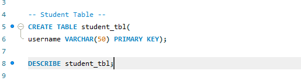
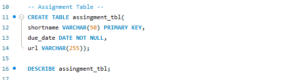
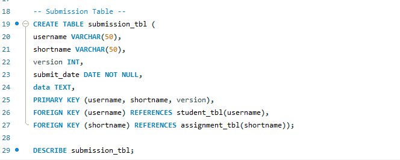
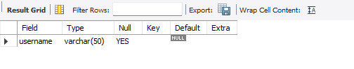
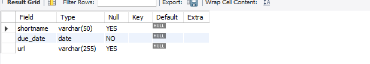
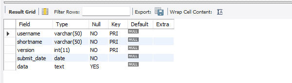
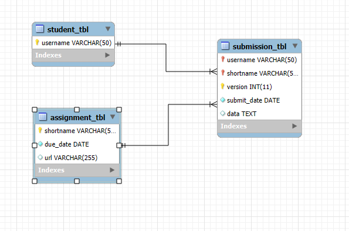

# Final Task 2
### 1. Create the student table:
-  Define username as a VARCHAR(50)
-  Set username as the Primary Key

### 2. Create the assignment table:
-  Define shortname as a VARCHAR(50) and set it as the Primary Key
-  Define due_date as a DATE NOT NULL
-  Define url as a VARCHAR(255), which can be null
### 3. Create the submission table:
-  Define username and shortname both as VARCHAR(50)
-  Define version as an INT
-  Define submit_date as a DATE NOT NULL
-  Define data as TEXT
-  Set a composite primary key of (username, shortname, version)
-  Add foreign keys referencing the student and assignment tables

## Table Relationships
### 1. student table
-  Primary Key: username
-  Relationships:
-  One-to-Many with submission: One student (username) can have many submissions.

### 2. assignment table
-  Primary Key: shortname
-  Relationships:
-  One-to-Many with submission: One assignment (shortname) can have many submissions.

### 3. submission table
- Composite Primary Key: (username, shortname, version)
    - Relationships:
    - Many-to-One with student: Each submission belongs to one student.
    - Many-to-One with assignment: Each submission is for one assignment.
    - This models a Many-to-Many relationship between students and assignments, with version tracking multiple submissions.
 

## Screenshots
#### Student Query Statement

#### Assignment Query Statement

#### Submission Query Statement

#### Student Table

#### Assignment Table

#### Submission Table

## ER Diagram

